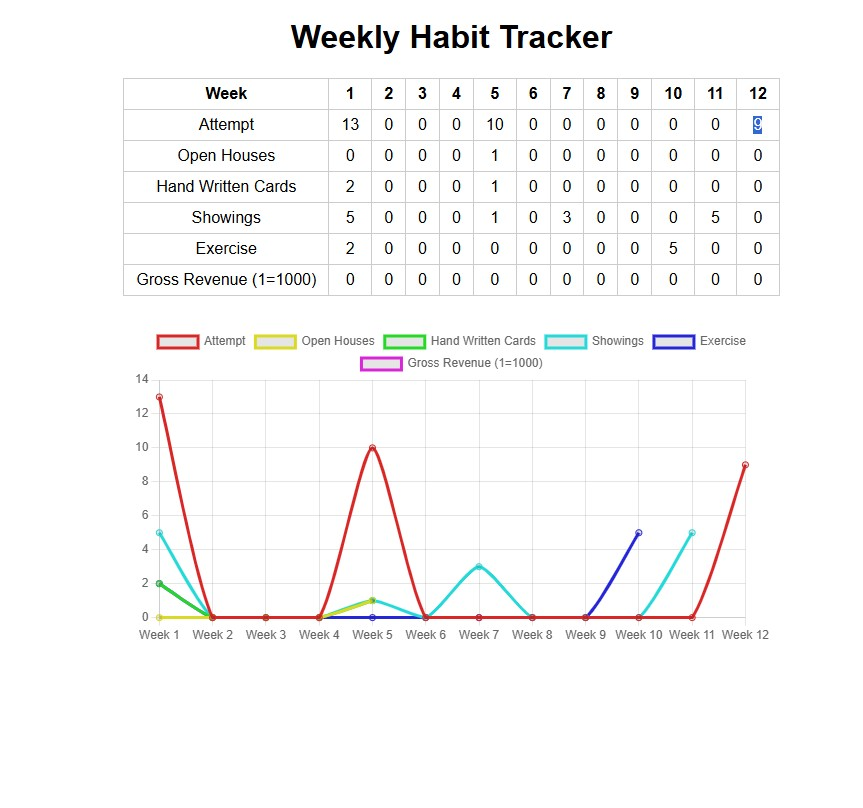

# Weekly Activity Tracker

This is a browser-based weekly activity tracker built with vanilla JavaScript, HTML, and CSS. It allows users to track weekly activity goals, visualize progress with a simple chart, and store the data locally in the browser.

This activity tracker was inspired by Ben Oosterveld's Weekly Activity Tracker, taught in his Sales To Scale course.

## Features

- Weekly table for tracking activities over 12 weeks
- Click to increment activity counts
- Ctrl + Click to decrement activity counts
- Automatically saves progress using localStorage
- Line chart visualizes activity progress over time
- Chart automatically trims to show only active weeks
- No frameworks or libraries beyond Chart.js

## Getting Started

1. Download or clone this repository.
2. Open `index.html` in any modern web browser.

No build steps or installations required.

## How to Use

- Click on a cell to increase the value by 1.
- Hold **Ctrl** and click to decrease the value by 1.
- Your changes are saved automatically in your browser’s local storage.
- The chart updates in real time and only displays weeks where data exists.

## Note

- IF YOU DELETE YOUR COOKIES YOU WILL LOSE ALL SAVED DATA!
